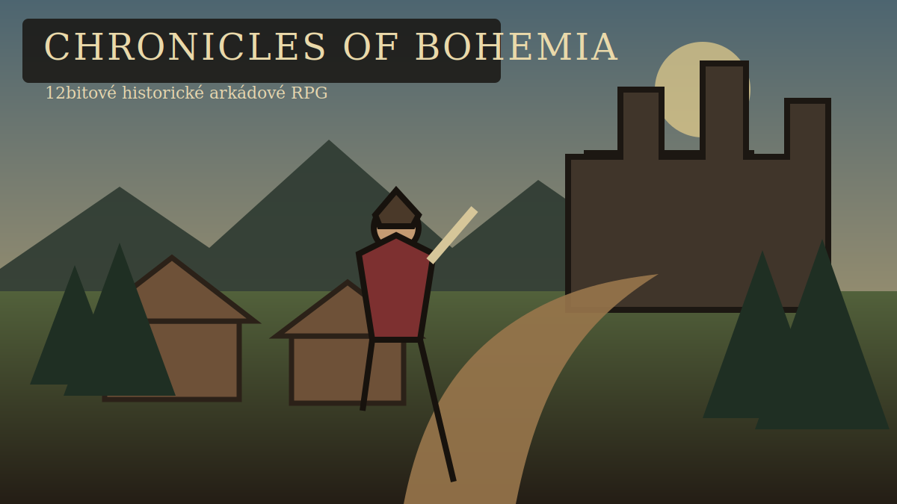

# Chronicles of Bohemia

Originální 12bitové historické arkádové RPG pro prohlížeč a mobilní zařízení.



## Spuštění

```bash
npm install
npm run dev
```

## Kontrola kvality

```bash
npm run lint
npm run typecheck
npm test
npm run build
npx playwright install chromium
npm run test:e2e
```

## Ovládání

### Klávesnice

- Pohyb: WASD nebo šipky.
- Interakce: E.
- Inventář: I; zavření také Escape.
- Útok: mezerník.
- Směr útoku/krytu: pohyb postavy nebo klávesy 1–5.
- Kryt: držet F.
- Úhyb: Shift.

### Mobil

- Pohyb: levý dotykový směrový ovladač.
- Inventář: tlačítko Batoh.
- Útok: klepnutí na tlačítko Útok.
- Směr útoku: táhnout po tlačítku Útok směrem nahoru, doleva, doprava nebo šikmo dolů.
- Obrana: držet Kryt; tlačítko Úhyb provede rychlý pohyb posledním směrem.

## Inventář a obchod

Batoh obsahuje vybavení, zásoby, nosnost a groše. Zbraň, zbroj a doplněk lze vybavit do samostatných slotů; spotřební předměty se používají přímo z inventáře.

Obchodní záložka se aktivuje pouze v blízkosti kupkyně Kateřiny během jejího denního režimu. Nákup i prodej kontroluje hotovost, zásoby, nosnost a maximální množství v jednom stacku.

## Pověst

Hráč má oddělenou pověst u sedláků, měšťanů a šlechty. Každá hodnota se pohybuje od −100 do +100 a odpovídá jedné z pěti úrovní důvěry: nepřátelská, nedůvěřivá, neutrální, vážená nebo ctěná.

Dokončení úkolu „První ocel“ zvýší pověst u všech tří skupin. Měšťanská pověst společně s charismatem vybavení ovlivňuje Kateřininy nákupní a prodejní ceny a může změnit její dialog.

## Nenápadnost

Strážný Vojtěch má viditelný zorný kužel odvozený z aktuálního směru jeho pohybu. Pobyt uvnitř kuželu zvyšuje podezření od klidu přes varování až k poplachu; blízký cíl je odhalen rychleji. Po opuštění kuželu podezření postupně vyprchá. Aktuální stav a procento zobrazuje herní HUD.

První verze systému vyhodnocuje úhel a vzdálenost. Budovy a stromy zatím výhled fyzicky nezakrývají a hra ještě nepoužívá přikrčení, hluk nebo světelnost prostředí.

## Stav

Hratelný řez obsahuje menu, vesnici s deseti obyvateli a denními režimy, datově řízené dialogy a quest, pětisměrný boj, kryt, dokonalý kryt, úhyb, inventář, vybavení, spotřební předměty, obchod, tři reputační skupiny, zorný kužel, podezření a poplach, save verze 4, mobilní ovládání a PWA konfiguraci.

Projekt je samostatné autorské dílo. Nekopíruje chráněné postavy, příběh, mapy, hudbu, dialogy ani vizuální materiály žádné existující hry.
